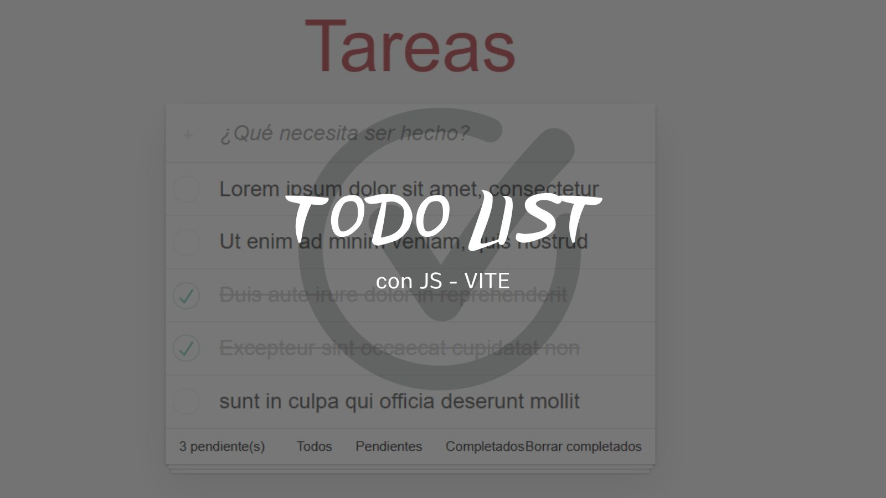

# Lista de Tareas con Filtros

Este proyecto es una aplicación de lista de tareas construida con **JavaScript** y **Vite**. Permite al usuario agregar, eliminar y filtrar tareas (completadas o pendientes) y almacena los datos utilizando **Local Storage** para que las tareas persistan incluso al recargar la página.

## Características

- **Agregar Tareas**: Añade una nueva tarea escribiendo en el campo de entrada.
- **Eliminar Tareas**: Elimina cualquier tarea de la lista.
- **Marcar Como Completada**: Permite alternar el estado de completada/pendiente de una tarea.
- **Filtros**: Filtra las tareas por estado: todas, completadas o pendientes.
- **Persistencia con Local Storage**: Las tareas se almacenan en el navegador para que no se pierdan al recargar la página.

## Tecnologías Utilizadas

- **JavaScript (ES6+)**
- **Vite** (como herramienta de desarrollo)
- **HTML5** y **CSS3**
- **Local Storage** para persistencia de datos
